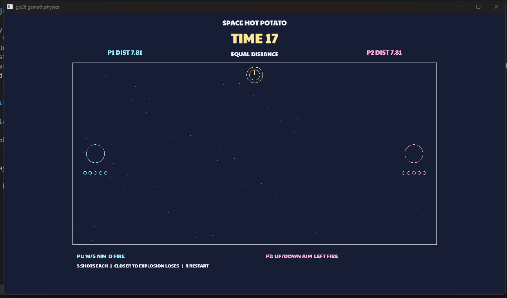

# Space Hot Potato

Author: Lee(jiaweil8)

Design: A two-player Hot Potato game set in space. Each stationary player has five balls to shoot at a floating bomb, using collisions and wall bounces to push it closer to their opponent before it explodes.

Screen Shot:

How To Play:
Player 1: W/S to aim, D to shoot.
Player 2: Up/Down arrows to aim, Left arrow to shoot.
Press R to restart the round.
Each round lasts 20 seconds. When the bomb explodes, the closer player loses; equal distances result in a draw. The HUD shows the time remaining, both distances, and the player currently in danger.
You only have five shots, and each ball disappears after seven seconds. Aim carefully, use wall bounces, and save shots for the final seconds.

## Extra Credit

Are your Physics Deterministic? If so, how can we verify this?
Not verified.

Are your Physics Rewindable? If so, how can we verify this?
Not implemented.

Google font Paytone https://fonts.google.com/specimen/Paytone+One

This game was built with [NEST](NEST.md).
